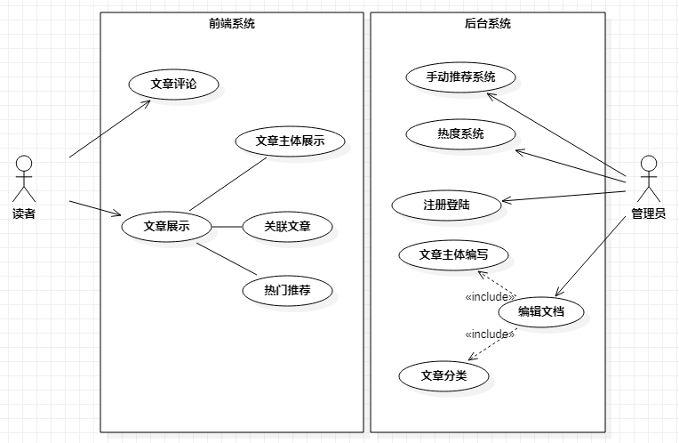

# DaiDai's Blog

这个项目的初衷：学习Web技术

次要目的：获得一个自我展示的平台，还有阿里云买了3年了，白白浪费了1年了。

## 需求分析：

用户（Actor）：

​		作者：主要为开发者本人。后面可能有别人加入？谁知道嗯？

​		读者：用开发者本人和一般网民。

​		管理员：添加作者等后台管理工作。

用户故事（Use Case）：

​		作者：编辑文章；知道文章的阅读量；知道读者的反馈。

​		读者：阅读文档；评论文章；方便收藏后下次查阅

​		管理员：后台管理工作；所有作者的管理；全站文章的阅读量，评论量等信息；

由于博客为个人博客，所以管理员同作者为同一个人，所以用例分析为：

## 技术框架选型

这里可以实现的web技术方式太多了，作者对web小白，都不懂，挑选一些比较正统成熟的技术。

前端：react

后端：springboot

前后端交互：ajax

数据库：mongodb

文档编辑方式：markdown编辑

工程实体为：

前端系统：blog-app

后端系统：blog-admin

web服务：blog-api

## 任务拆分

- [ ] 数据库设计
- [ ] web服务提供Demo数据Rest
- [ ] 前端系统-文章主体展示
- [ ] 前端系统-文章评论系统

- [ ] 后台系统-用户权限管理
- [ ] 后台系统-注册登录
- [ ] 后台系统-编辑文档
- [ ] 后端系统-热度系统，手动推荐
- [ ] 前端系统-热门推荐
- [ ] 前端系统-关联推荐

## 项目进行日志

2020-11-30 

项目基础文档编写

2020-12-01

ajax完成基础使用

